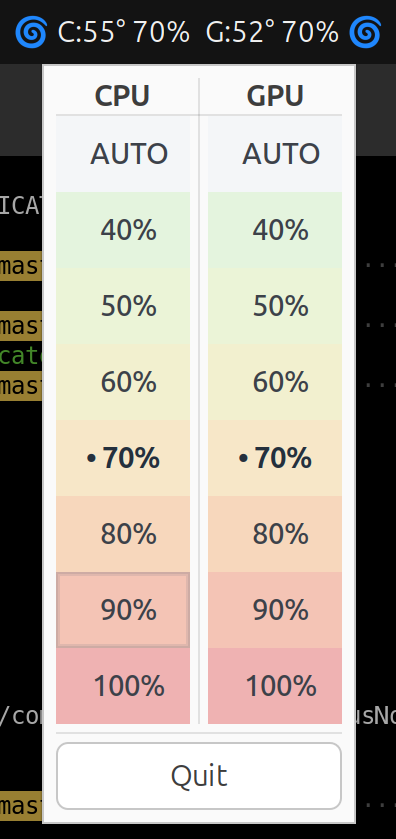
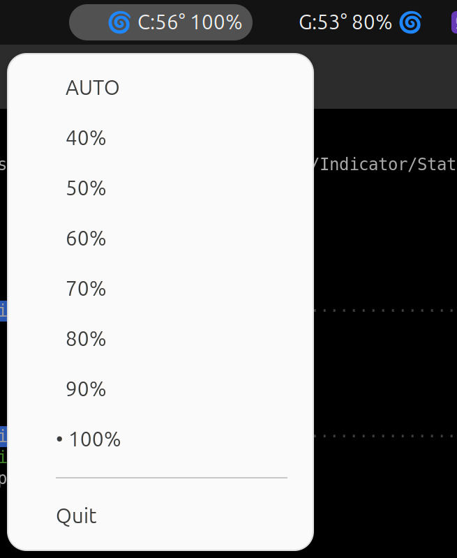

# Clevo Laptop Fan Speed Utility

Control CPU and GPU fans on supported Clevo laptops.

Use the project to:

- read CPU/GPU temperature, duty, and RPM values
- set CPU and GPU fan duty manually from the CLI
- run automatic fan control based on the hottest component
- open a GNOME panel indicator with a dual-column CPU/GPU control popup

Build on top of:

- https://github.com/davidrohr/clevo-indicator
- https://github.com/SkyLandTW/clevo-indicator

## Build

Install the build dependencies required by the build:

```bash
sudo apt install build-essential pkg-config libgtk-3-dev libayatana-appindicator3-dev
```

Build the project:

```bash
git clone https://github.com/gzzchh/clevo-indicator
cd clevo-indicator
make
```

On distributions other than Ubuntu/Debian, install packages that provide these `pkg-config` targets:

- `gtk+-3.0`
- `ayatana-appindicator3-0.1`

## Install

Install the binary with the setuid-root mode required for EC access:

```bash
sudo make install
```

The install target places the binary at:

```text
/usr/local/bin/clevo-indicator
```

## Run

Use the CLI commands directly:

```text
clevo-indicator set [fan-duty-percentage]
clevo-indicator setg [fan-duty-percentage]
clevo-indicator dump
clevo-indicator dumpall
clevo-indicator auto
clevo-indicator indicator
clevo-indicator help
```

Use `fan-duty-percentage` as an integer percentage value.

Examples:

```bash
clevo-indicator dump
clevo-indicator set 70
clevo-indicator setg 80
clevo-indicator auto
/usr/local/bin/clevo-indicator indicator
```

## Use The GNOME Panel UI

Run the indicator with:

```bash
/usr/local/bin/clevo-indicator indicator
```

Expect the default UI to provide:

- one combined top-bar label
- one custom popup window
- separate CPU and GPU control columns
- presets `AUTO`, `40%`, `50%`, `60%`, `70%`, `80%`, `90%`, `100%`

### Install The Required GNOME Host Fork

Use the patched GNOME AppIndicators host extension. Stock GNOME AppIndicators do not provide the required behavior for this UI.

Required host behavior:

- hide the icon actor completely
- route primary click to `Activate(x, y)` instead of always opening DBusMenu

Use this fork:

- GitHub: `git@github.com:ignatremizov/gnome-shell-extension-appindicator.git`
- local clone: `~/code/gnome-shell-extension-appindicator`
- local extension UUID: `appindicatorsupport@ignatremizov.com`
- local install path:
  `~/.local/share/gnome-shell/extensions/appindicatorsupport@ignatremizov.com`

Treat the single-indicator UI as a two-part system:

1. export a native `StatusNotifierItem` from this repo
2. consume `XClevoShowIcon=false` and `XClevoPreferActivate=true` in the patched GNOME host

Read [docs/SNI_HOST_PATCH.md](docs/SNI_HOST_PATCH.md) for the host-side details.

### Force The Legacy UI

Force the dual-AppIndicator fallback for compatibility or debugging:

```bash
CLEVO_LEGACY_APPINDICATOR=1 /usr/local/bin/clevo-indicator indicator
```

Use that mode when the patched GNOME host fork is unavailable or when you want to compare the old flat-menu behavior.

## Screenshots

Default single-indicator UI:



Legacy dual-AppIndicator UI:



## Privilege Model And Safety

Run the indicator as the desktop user. Let the installed setuid bit supply the root privileges required for EC access.

The binary must do both of these jobs:

- run UI code as the desktop user so GNOME can show the indicator
- access Clevo EC interfaces with root privileges

That split causes the process tree to fork into a UI side and a privileged worker side. Killing either process will terminate the other.

Do not run other EC-tweaking tools at the same time. This project does not coordinate low-level EC access across multiple processes.

Avoid `kill -9` unless there is no other recovery path.

## Contributing

Read [CONTRIBUTING.md](CONTRIBUTING.md) for workflow and commit-message conventions.

Read [docs/ARCHITECTURE.md](docs/ARCHITECTURE.md) for the UI and worker design.

## Hacking

Edit `control_rows[]` in [src/clevo-indicator.c](src/clevo-indicator.c) to change the CPU/GPU preset list exposed in the popup and legacy menus.

Preset table:

```c
static FanControlRow control_rows[] = {
    {"AUTO", 0, AUTO, NULL, NULL, NULL, NULL},
    {"40%",  40, MANUAL, NULL, NULL, NULL, NULL},
    {"50%",  50, MANUAL, NULL, NULL, NULL, NULL},
    {"60%",  60, MANUAL, NULL, NULL, NULL, NULL},
    {"70%",  70, MANUAL, NULL, NULL, NULL, NULL},
    {"80%",  80, MANUAL, NULL, NULL, NULL, NULL},
    {"90%",  90, MANUAL, NULL, NULL, NULL, NULL},
    {"100%", 100, MANUAL, NULL, NULL, NULL, NULL},
};
```

Edit `ec_auto_duty_adjust()` in [src/clevo-indicator.c](src/clevo-indicator.c) to change the automatic duty curve.
