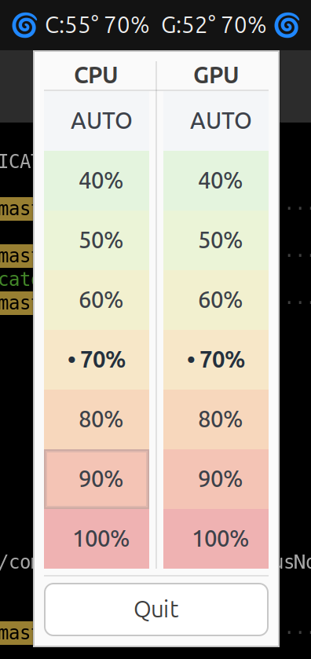
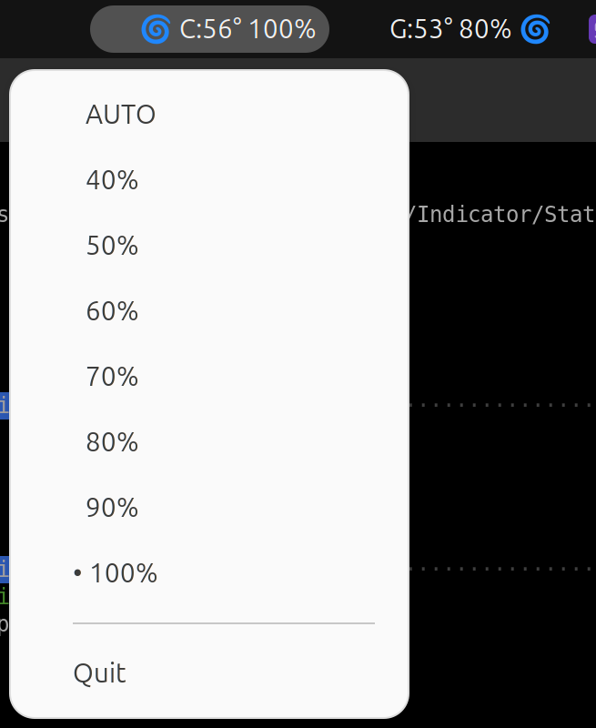

# Clevo Laptop Fan Speed Utility

Control CPU and GPU fans on supported Clevo laptops.

## Screenshots

Default single-indicator UI:



Legacy dual-AppIndicator UI:



## Features

Use the project to:

- read CPU/GPU temperature, duty, and RPM values
- set CPU and GPU fan duty manually from the CLI
- run automatic fan control based on the hottest component
- open a GNOME panel indicator with a dual-column CPU/GPU control popup

Build on top of:

- https://github.com/davidrohr/clevo-indicator
- https://github.com/SkyLandTW/clevo-indicator

## Hardware Compatibility

This fork is developed on an XoticPC-supplied laptop whose DMI reports board **`X170KM-G`**, vendor `SchenkerTechnologiesGmbH`, and product `XMG ULTRA 17 (Early 2021)`. Reseller branding and firmware-reported names can differ. The EC GPU temperature address used on this machine is **`0xCD`**, not `0x0A`. The indicator and CLI share the named register definitions in [src/ec-monitor.h](src/ec-monitor.h). The indicator prefers a valid, fresh NVIDIA temperature reading and falls back to the EC GPU temperature when that reading is unavailable.

Older source carried an unused `#define P775DM3` before these addresses. It did not select a register map or detect the laptop model; its provenance is now retained in the shared header's comment rather than a misleading model-selection macro. The inherited layout has been used on the development machine, but this is not an independently reverse-engineered register specification for every X170KM-G or firmware revision.

Register mappings differ between models and forks: for example, [gateslu's `v1.0` implementation](https://github.com/gateslu/clevo-indicator/blob/91ec5041eebdd97b2507c8f9c99ef631b68d947d/src/clevo-indicator.cpp#L24) uses **`0x0A`**. Neither address is a universal Clevo mapping. Verify the target model's temperature registers and fan-control protocol before using this fork on another laptop or importing hardware-specific changes; these mappings are currently hardcoded, not automatically detected.

### Register Mappings Across Forks: Shared Layouts And Exceptions

A recursive GitHub fork survey on 2026-09-10 found 72 accessible forks, including this one. Their default-branch EC register definitions were inspected, including renamed source files; gateslu's non-default `v1.0` branch was additionally checked. This is a source reference, not a supported-device list or an exhaustive audit of every branch and hardware access path. Identical definitions indicate shared source assumptions, not independent device confirmations or identical runtime behavior. External source examples are pinned to commits.

| Source-layout group | CPU / GPU temperature | CPU / GPU duty definitions | CPU / GPU RPM counter definitions | Forks |
| --- | --- | --- | --- | --- |
| Original single-fan layout | `0x07` / `0xCD` | `0xCE` / absent | `0xD0, 0xD1` / absent | 50 |
| Dual-fan `0xCD` layout, including this fork | `0x07` / `0xCD` | `0xCE` / `0xCF` | `0xD0, 0xD1` / `0xD2, 0xD3` | 15 |
| Dual-fan `0x0A` layout | `0x07` / `0x0A` | `0xCE` / `0xCF` | `0xD0, 0xD1` / `0xD2, 0xD3` | 2 |
| Dual duty definitions, CPU RPM only | `0x07` / `0xCD` | `0xCE` / `0xCF` | `0xD0, 0xD1` / absent | 2 |
| Partial GPU RPM implementation; see caveat below | `0x07` / `0xCD` definition | `0xCE` / absent | `0xD0, 0xD1` / only `0xD2` defined | 2 |
| CPU-only main daemon | `0x07` / absent | `0xCE` / absent | `0xD0, 0xD1` / absent | 1 |

Device evidence for these groups:

- **Dual-fan `0xCD`:** [This fork](src/clevo-indicator.c) is used on the development machine identified above. Clevo P775DM3 is named in the inherited [davidrohr](https://github.com/davidrohr/clevo-indicator/blob/6f85d0244359b011a10523ee9741fd41cc1af660/src/clevo-indicator.c#L67-L78) and [nicuessa](https://github.com/nicuessa/clevo-indicator/blob/4d69245ff2d31f085f6d1e593f25a3092f799558/src/clevo-indicator.c#L67-L78) source; hardware validation details are not documented.
- **Dual-fan `0x0A`:** gateslu's `v1.0` [README](https://github.com/gateslu/clevo-indicator/blob/91ec5041eebdd97b2507c8f9c99ef631b68d947d/README.md) explicitly allowlists COLORFUL X17 Pro Max. [Seb-sti1's implementation](https://github.com/Seb-sti1/clevo-indicator/blob/06c06c8d416747841c0dbdffa225720db19d7624/src/clevo-indicator.c#L73-L81) targets Gigabyte G5 MF5 2024; its [README](https://github.com/Seb-sti1/clevo-indicator/blob/06c06c8d416747841c0dbdffa225720db19d7624/README.md) tentatively identifies it as rebranded Clevo RC555 and reports GPU temperature verification against NVIDIA readings under load. These are author-reported targets, not devices independently tested by this project.
- **Original single-fan:** [SkyLandTW's implementation](https://github.com/SkyLandTW/clevo-indicator/blob/67facb8ebb3a5b098f11618205e4f42353c6981e/src/clevo-indicator.c#L67-L72) supplies the baseline layout; its README does not establish a specific model.

Duty addresses above are telemetry/readback locations, **not instructions to write directly to those registers**. RPM entries identify the two-byte counters used to calculate speed (high byte, low byte), not raw RPM values. Matching temperature addresses does not establish compatible fan commands, scaling, safe minimum duties, or firmware behavior. “Absent” means absent from that implementation, not absent from the hardware.

<details>
<summary>Fork membership by layout (GitHub owner names)</summary>

Owner names below identify the surveyed repositories in the SkyLandTW fork network; renamed repositories are called out explicitly. The pinned examples establish each layout, while membership records the default-branch snapshot on the review date.

- **Original single-fan layout:** Cotix, GuilloOme, HarrisonGregg, MrPiggy, NotesOfReality, OnnoBH, Soropureiya, WanQingGit, Wiimpathy, acidburn0zzz, adnan-alhomssi, alxb421, bradmccormack, brucej83, brunoais, cardozogp, codepeak, cuantar, cympfh, dainank, dbeniamine, dbtdsilva, digideskio, draekko, dszryan, eightone0, eliotlim, fouvy, gdoteof, gilvbp, hphilm, huaixv, idqaq, karamanh, kmwhite, littledragonblue, ljkgpxs, magavdraakon, ocrastroav, pedroguima, pnquan90, sathishkumark27, starlitxiling, superdan301246, sviande, taner1, theangrydev, wcasanova, yangzhl, yazawaniconii. These share the register set in the pinned SkyLandTW source above. Renamed repositories include `alxb421/cyrex-fanconrol`, `dainank/clevo-indicator-arch`, `dbtdsilva/clevo-indicator-sensors`, and the `system76-galapago-pro-fan-unfucker` repositories owned by Wiimpathy, cympfh, and gdoteof.
- **Dual-fan `0xCD` layout:** Brainiarc7, DiarmuidKelly, KediYamuk, PolicyChanges, davidrohr, devandrepascoa, ignatremizov, jacobmischka, jadetr, jcmonteiro, kepelrs, nicuessa, velaar, viridian1138, wmdhs12138. See the pinned davidrohr/nicuessa sources above. Matching constants do not mean the EC is always the selected temperature source: [DiarmuidKelly](https://github.com/DiarmuidKelly/clevo-indicator/blob/8c26abeaf1da2f52ccad586430dbd42a7b5280bc/src/clevo-indicator.c) also uses NVIDIA NVML.
- **Dual-fan `0x0A` layout:** Seb-sti1 and gateslu. See the model evidence above; [gateslu's default branch](https://github.com/gateslu/clevo-indicator/blob/a5438f7a01189dcc67ec99f2c0eb0441abe8398f/src/clevo-indicator.cpp) and its separately reviewed `v1.0` branch use the same eight addresses.
- **Dual duty definitions, CPU RPM only:** [comexr/comexr-fan-control-he](https://github.com/comexr/comexr-fan-control-he/blob/da4aaa4b63a6f7cdd5429387d966e1eb631ab54a/src/comexr-fan-control-he.c) and [digitalsparky/comexr-fan-control-he](https://github.com/digitalsparky/comexr-fan-control-he/blob/b28179ef5eeac62aad4d5dbae22df8187668ff1e/src/comexr-fan-control-he.c). Defining GPU duty does not provide a GPU RPM counter or guarantee that the UI reads both duties.
- **Partial GPU RPM implementation:** [bob912](https://github.com/bob912/clevo-indicator/blob/f66edfccb51f70508596b81cbe32eba7f081d8d4/src/clevo-indicator.c) and [hakanyorulmaz](https://github.com/hakanyorulmaz/clevo-indicator/blob/596ac32612e62d4e803726aab396de0f38df9e9e/src/clevo-indicator.c). Both pass `0xD2` data as both bytes of their GPU RPM calculation rather than defining a separate low byte. This is a source-level anomaly, not evidence for a different validated counter layout. bob912 also comments that `0xCD` appears to return zero after late-2019 updates and bypasses it in the GPU temperature accessor.
- **CPU-only main daemon:** [jhstatewide/system76-galapago-pro-fan-unfucker](https://github.com/jhstatewide/system76-galapago-pro-fan-unfucker/blob/2ff1d8c1289c67c83577de6bb925e4175da8b759/src/clevo-daemon.c). Its main daemon uses CPU temperature and one fan; retained diagnostic/test sources still contain `0xCD`, which should not be mistaken for active GPU control support.

</details>

The broad pattern is therefore two common GPU temperature addresses, not dozens of independently established device maps. Inherited constants, inactive GPU sensors, external NVIDIA readings, and partial implementations all make a repository count a poor measure of hardware compatibility.

When reporting another device, include its exact model and BIOS/EC firmware versions, the source revision, and how each reading was validated. Keep uncertain mappings explicitly marked as unverified; do not probe unknown writes or run competing EC control tools to fill in the table.

## Build

Install the build dependencies required by the build:

```bash
sudo apt install build-essential pkg-config libgtk-3-dev libayatana-appindicator3-dev
```

Build the project:

```bash
git clone https://github.com/gzzchh/clevo-indicator
cd clevo-indicator
make
```

On distributions other than Ubuntu/Debian, install packages that provide these `pkg-config` targets:

- `gtk+-3.0`
- `ayatana-appindicator3-0.1`

## Hardware-Free Regression Tests

```bash
make check
make -B check TEST_SANITIZERS='-fsanitize=address,undefined -fno-omit-frame-pointer'
```

These tests do not require root, access the EC/NVIDIA hardware, initialize GTK, launch the indicator, or change fan settings. They use mocked EC reads/port I/O, the real worker loop, and disposable subprocess fixtures for GPU-query tests. The historical `make test` target is **not** a test suite: it changes the built binary's ownership and setuid permissions.

## Indicator Polling And Fault Handling

- CPU temperature is sampled once per second through Linux's `coretemp` hwmon driver, discovered by device name and `Package id` labels rather than a fixed `hwmonN`. The hottest valid package is used. If that source is unavailable or invalid, the worker reads the EC CPU temperature register instead. GPU EC temperature is likewise read only when the NVIDIA source is unavailable. No new driver or subprocess is needed for coretemp.
- Fan duties are read at startup and every 30 seconds while stable, with readback on the next control tick after every write attempt. Failed or unconfirmed readbacks are checked once per second. Pre-write duty data is invalidated for the affected fan; cached verified duties remain usable between routine checks. This deliberately allows up to roughly 30 seconds to detect unsolicited firmware/external duty changes.
- Background RPM reads are disabled by default. Set `CLEVO_MONITOR_RPM=1` when launching the indicator to sample both RPM counters once per second for diagnostics; disabled or failed RPM telemetry is `-1`. Explicit CLI diagnostics retain their on-demand reads, including RPM in `dump` and the full 256-byte register space in `dumpall`.
- With healthy native temperature sources, RPM disabled, and stable fan settings, routine EC traffic is only the two duty bytes every 30 seconds. Temperature fallbacks, command verification, and optional RPM telemetry add reads only as needed. The 200 ms control-loop sleep and normal curve/hysteresis logic remain unchanged, but the new CPU source and one-second temperature cadence can change when curve thresholds are crossed. Reads and writes add latency; these intervals are not hard real-time deadlines.
- Each requested EC field group is published only after a complete read; temperature, duty, and optional RPM failures are handled independently. Previously valid temperatures expire after three seconds. Values outside 15–125°C are treated as invalid; unavailable temperatures are exposed as `-1`, including in the panel label.
- NVIDIA queries use `/usr/bin/nvidia-smi` without a shell, have a 1.5-second deadline, and invalidate their cached temperature on failure. Expired or invalid NVIDIA data falls back to fresh EC GPU data. The query thread waits one second between attempts. If a killed query remains stuck in the driver, the thread does not spawn a replacement until that child exits.
- If either temperature is unavailable, fans explicitly selected as **AUTO** request 100% until valid readings return. Manual fan settings are not overridden. Fault/recovery messages are logged on transitions. This is a conservative sensor-failure policy, not a change to the normal fan curve.
- Failed readback holds ordinary automatic adjustments; emergency requests remain possible. A fan command is confirmed only by a fresh duty readback, with one percentage point of tolerance for ordinary targets and exact 100% for emergency targets. Unconfirmed requests are retried at most once every two seconds per fan; a new 100% escalation can bypass that delay.
- Port-protocol timeouts stop the command rather than sending subsequent bytes after a failed wait. Repeated attempts are rate-limited, not abandoned after a finite retry count, because the requested cooling may still be needed.

The kernel's [`ec_sys` read implementation](https://github.com/torvalds/linux/blob/master/drivers/acpi/ec_sys.c) performs an EC transaction for each requested byte. This is why reducing the register range matters even though the old code used a single `read()` call.

### Measured EC Reduction

The first optimization replaced a full 256-byte EC dump on every control cycle with eight targeted bytes. Live validation on the development machine reduced ACPI IRQ CPU from about 10% to 0.6–0.8% of one core and EC interrupts from approximately 1,491 to 80 per second.

Native temperature sources and sparse feedback now reduce stable background reads further: from eight bytes per roughly 200 ms cycle to **two duty bytes every 30 seconds**. At the nominal cadence, that is about **600 times fewer EC bytes** than the eight-byte implementation, excluding startup, temperature fallbacks, fan commands, and optional RPM polling. Actual cycles include hardware latency.

Two 60-second before/after windows on the development machine measured the following additional reduction. Both fans remained in AUTO at 42%, with CPU temperatures around 45–47°C and GPU temperature at 44°C; compilation was outside the measurement windows.

| Measurement | Eight-byte polling | Native temperatures + sparse feedback |
| --- | --- | --- |
| `irq/9-acpi` CPU, percent of one core | 0.600% | 0.000% at CPU tick resolution |
| Worker CPU, percent of one core | 0.283% | 0.183% |
| Indicator UI CPU, percent of one core | 1.583% | 0.883% |
| EC interrupts per second (`gpe6E`) | 77.856 | 0.133 |
| RAPL CPU package power | 8.269 W | 8.248 W |
| RAPL platform (`psys`) estimate | 75.456 W | 75.206 W |

The measured EC interrupt reduction is approximately **99.8%** relative to eight-byte polling. The roughly 0.25 W platform-power difference is small and inconclusive under a changing desktop workload, not a quantified battery-life gain. RAPL is not a wall-socket measurement, its domains overlap, and process CPU figures exclude short-lived NVIDIA query children. These are observations on one machine, not guarantees for other devices or workloads; a zero IRQ CPU sample means below tick resolution, not zero work.

### Validation Before Deployment

Building and running `make check` does not replace the installed indicator. Live deployment must be a separate, approved operation: preserve the installed binary for rollback, record current modes/duties, install the candidate, and gracefully restart only the indicator at an agreed time. Verify temperatures, duties, controls, `gpe6E` rate, and `irq/9-acpi` CPU against a baseline under a comparable workload. Do not mask the embedded controller's interrupt.

The worker still relies on kernel EC calls completing and on the existing Clevo-specific direct-port write protocol. These changes do not add a hardware watchdog, coordinate with other EC writers, or guarantee recovery from a stalled controller/GPU driver. Do not run another EC control tool concurrently.

## Install

Install the binary with the setuid-root mode required for EC access:

```bash
sudo make install
```

The install target places the binary at:

```text
/usr/local/bin/clevo-indicator
```

## Run

Use the CLI commands directly:

```text
clevo-indicator set [fan-duty-percentage]
clevo-indicator setg [fan-duty-percentage]
clevo-indicator dump
clevo-indicator dumpall
clevo-indicator auto
clevo-indicator indicator
clevo-indicator help
```

Use `fan-duty-percentage` as an integer percentage value.

Examples:

```bash
clevo-indicator dump
clevo-indicator set 70
clevo-indicator setg 80
clevo-indicator auto
/usr/local/bin/clevo-indicator indicator
```

## Use The GNOME Panel UI

Run the indicator with:

```bash
/usr/local/bin/clevo-indicator indicator
```

Expect the default UI to provide:

- one combined top-bar label
- one custom popup window
- separate CPU and GPU control columns
- presets `AUTO`, `40%`, `50%`, `60%`, `70%`, `80%`, `90%`, `100%`

### Install The Required GNOME Host Fork

Use the patched GNOME AppIndicators host extension. Stock GNOME AppIndicators do not provide the required behavior for this UI.

Required host behavior:

- hide the icon actor completely
- route primary click to `Activate(x, y)` instead of always opening DBusMenu

Use this fork:

- GitHub: `git@github.com:ignatremizov/gnome-shell-extension-appindicator.git`
- local clone: `~/code/gnome-shell-extension-appindicator`
- local extension UUID: `appindicatorsupport@ignatremizov.com`
- local install path:
  `~/.local/share/gnome-shell/extensions/appindicatorsupport@ignatremizov.com`

Treat the single-indicator UI as a two-part system:

1. export a native `StatusNotifierItem` from this repo
2. consume `XClevoShowIcon=false` and `XClevoPreferActivate=true` in the patched GNOME host

Read [docs/SNI_HOST_PATCH.md](docs/SNI_HOST_PATCH.md) for the host-side details.

### Force The Legacy UI

Force the dual-AppIndicator fallback for compatibility or debugging:

```bash
CLEVO_LEGACY_APPINDICATOR=1 /usr/local/bin/clevo-indicator indicator
```

Use that mode when the patched GNOME host fork is unavailable or when you want to compare the old flat-menu behavior.

## Privilege Model And Safety

Run the indicator as the desktop user. Let the installed setuid bit supply the root privileges required for EC access.

The binary must do both of these jobs:

- run UI code as the desktop user so GNOME can show the indicator
- access Clevo EC interfaces with root privileges

That split causes the process tree to fork into a UI side and a privileged worker side. Killing either process will terminate the other.

Do not run other EC-tweaking tools at the same time. This project does not coordinate low-level EC access across multiple processes.

Avoid `kill -9` unless there is no other recovery path.

## Contributing

Read [CONTRIBUTING.md](CONTRIBUTING.md) for workflow and commit-message conventions.

Read [docs/ARCHITECTURE.md](docs/ARCHITECTURE.md) for the UI and worker design.

## Hacking

Edit `control_rows[]` in [src/clevo-indicator.c](src/clevo-indicator.c) to change the CPU/GPU preset list exposed in the popup and legacy menus.

Preset table:

```c
static FanControlRow control_rows[] = {
    {"AUTO", 0, AUTO, NULL, NULL, NULL, NULL},
    {"40%",  40, MANUAL, NULL, NULL, NULL, NULL},
    {"50%",  50, MANUAL, NULL, NULL, NULL, NULL},
    {"60%",  60, MANUAL, NULL, NULL, NULL, NULL},
    {"70%",  70, MANUAL, NULL, NULL, NULL, NULL},
    {"80%",  80, MANUAL, NULL, NULL, NULL, NULL},
    {"90%",  90, MANUAL, NULL, NULL, NULL, NULL},
    {"100%", 100, MANUAL, NULL, NULL, NULL, NULL},
};
```

Edit `ec_auto_duty_adjust()` in [src/clevo-indicator.c](src/clevo-indicator.c) to change the automatic duty curve.
